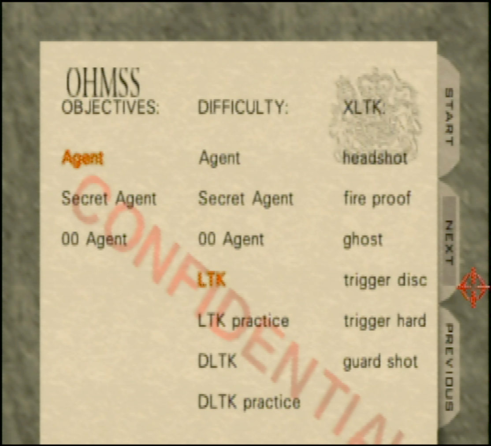
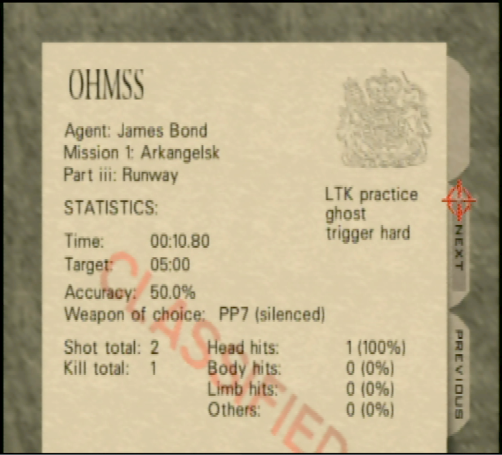

Extended License To Kill romhack

Short description:

Choose any set of objectives for any difficulty; adds additional challenge modes.

Short (44 seconds) youtube demo: https://www.youtube.com/watch?v=5AeiRSg-5eE

Long description:

Difficulty is separated from objectives now. LTK, LTK Practice, DLTK, and DLTK Practice are added as selectable difficulties. Now it is possible to play LTK with Agent objectives.

All cheats and stages are unlocked.

Added the following game options (XLTK)

- "headshot": Headshot only mode. Only headshots and hat shots will register.
- "fire proof": Guards no longer take damage from explosions.
- "ghost": Bond starts with less than one bar of health.
- "trigger disc / trigger hard / guard shot": Three mutually exclusive options. Trigger discipline mode damages Bond unless he shoots a Guard, Object, Weapon, or Door (missing causes damage). Trigger discipline (hard) mode is the same, except shooting Doors will cause damage. Guard shot mode causes damage to Bond when a Guard is shot (unarmed, knives, explosions excluded).

The end screen has been modified to show decimal time, as well as the selected difficulty and enabled game options.

This is a minimal romhack, the goal is to be as close to original implementation of the game as possible while supporting the above changes.

-----

Difficulty select screen:

End screeen:

