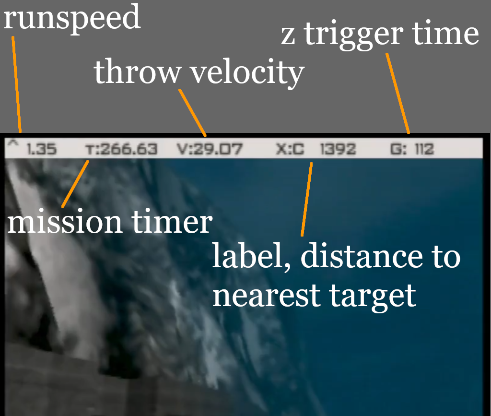
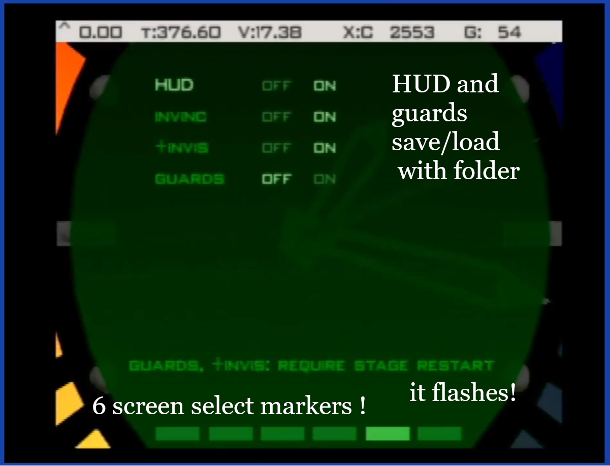

# R-lean practice ROM

This romhack is designed for practicing r-lean throws on Surface 2 and Runway. It will provide a HUD showing absolute distance (in 3d) from explosion to the closest objective prop, velocity of thrown object, and z trigger hold time. Support to show explosion distance for other level targets has been added as well, even though these are not necessarily r-lean targets.

youtube overview: https://www.youtube.com/watch?v=0xhOHotI4b4

List of levels supported:
-	Runway (00): missile battery, heavy guns
-	Surface 2 (A): comms
-	Depot (00): weapons cache
-	Jungle: drone guns
-	Control: mainframes
-	Caverns (SA): ~ radio area
-	Cradle: console

# Version

The NTSC-U xdelta patch should be applied against US NTSC .z64 with SHA1 `ABE01E4AEB033B6C0836819F549C791B26CFDE83`.

--

Something happened during development, I found out the NTSC-J won't boot during final testing, I will try to get that working (maybe ...). I'm assuming this affects EU as well, so neither one of those are posted.

# User Interface

The HUD looks like:

From left to right:

- `^`: shows current forward/back speed
- `T`: mission timer
- `V`: last item throw velocity
- `X`: explosion distance to nearest target. There are two characters reserved at the start to label the item. The first character is the related objective. The second character is the order of the item listed in the level definition. This is why the very first drone in Jungle is #2.
- `G`: If Z trigger is held, this is the current hold time in ticks. Otherwise, this is the hold time of last grenade release (hence the "G").

The watch menu looks like:

I know this doesn't look like much, but this was a lot of work, mostly due to technical reasons about how much is currently known in decomp. But look at that. Six screens, six screen markers, and your current screen marker now flashes.

Ok, more importantly, you can toggle the four options available in the romhack:

- HUD: The main HUD at the top of the screen. Value should be saved and loaded with the current folder.
- "invinc": standard invincibility cheat. This should sync with the cheat menu option. (does not save/load)
- "+invis": improved invisibility cheat. This should sync with the cheat menu option. More details below. (does not save/load)
- guards: toggles guard spawns on or off. Value should be saved and loaded with the current folder.

# +Invisibility
Standard invisibility cheat with some additional changes. Sets drone gun aim distance to 1cm. Periodically resets security camera "seen Bond" internal count so that alarm threshold is never reached. Allows line of sight check to succeed for the following:

- Facility: Trev, Dr. Doak
- Bunker 1: Boris
- Bunker 2: Natalya
- Statue: Trevelyn, Natalya
- Archives: Valentine, Mishkin
- Streets: Valentine
- Train: Xenia, Ouromov, Natalya
- Control: Natalya

# Guard Option
Disables guards during initial stage setup. Also intercepts other guard creation events, like cloning and AI scripts. Exception was made for Dr. Doak to still spawn even with guards disabled.

# Ammo
The game will periodically add more ammo to your inventory once you’ve picked up that item. This is level specific, and only implemented for explosive related thrown ammo. For example, it will only replenish timed mine when on Caverns, but will check remote mine when playing Control.

# End screen
The end screen has been changed to show two decimals.

# Controller shortcuts

These shortcuts work in solo game mode, regardless of the current control style.

**Exit to title**:

controller 1: Z + DPAD Down + all C buttons + R trigger

or

controller 1: Z + DPAD Down  
controller 2: Z + DPAD Down  

**Restart stage**:

controller 1: Z + DPAD Down + Start

or

controller 1: Z + DPAD Down  
controller 2: Z + Start  
