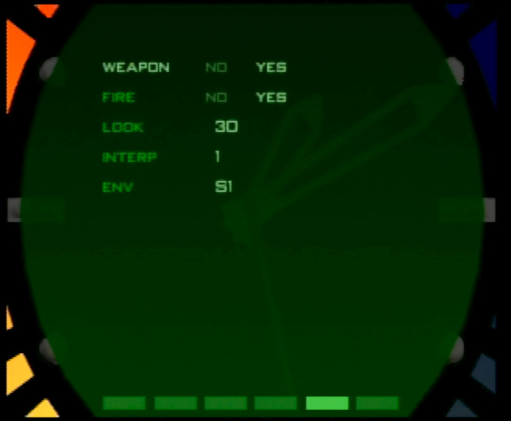
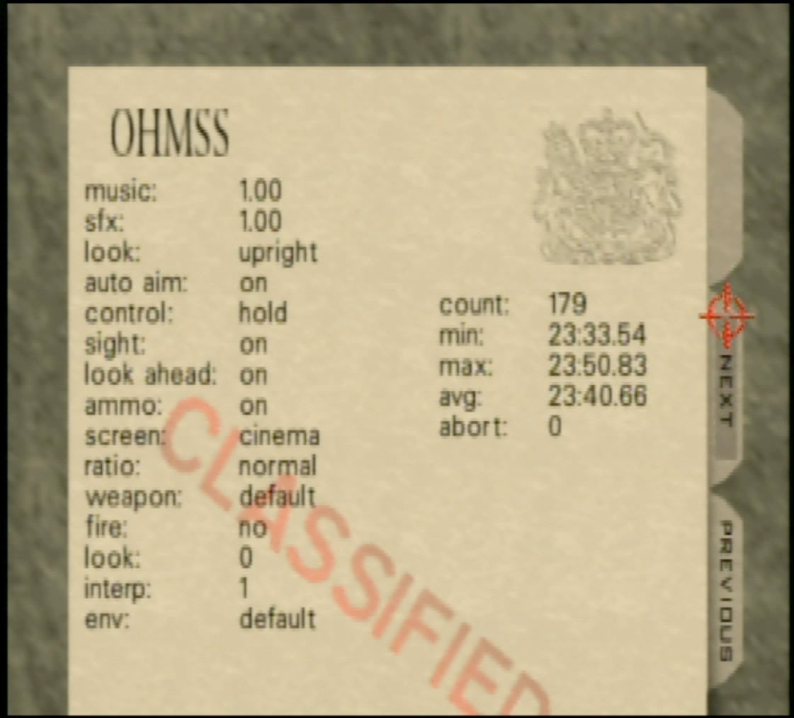

# Benchmark ROM

I have written a simple "TAS" for Runway which will play the level on repeat and gather run statistics.

Actions are performed after a certain number of ticks have passed. There is some "active sensing" when turning and when adjusting to the correct look up/down angle -- instead of hold button for X number of frames, it holds the button until the angle is reached.

I have removed the drones, all gaurds, all doors, and removed the AI script to spawn guards; I moved the spawn point forward to avoid (some) turning. The level ends when you pass a z position threshold at the end of the runway.

The level will continuously loop until you press **L Trigger**. You can pause to adjust settings, the run will be discounted from the session; you're free to move until you quit out.

Note: you need a clean quit out (not L Trigger) to save settings.

# Version

2022-03-24 (v1.3): Fix unarmed. Fix infinite ammo.
2022-03-20 (v1.2): Adjust variance display
2022-03-18 (v1.1): Added variance to end screen for statistical analysis.  
2022-03-17 (v1.0): initial release  

# Watch menu

I added a watch screen:



This allows changing the following settings:

- weapon: whether to switch to the selected weapon in the run. All guns cheat is enabled, choose a weapon from the inventory page.
- fire: whether to fire the weapon during the run
- look: amount of look up or down. Positive is look up, negative is look down. Unless controls are reversed.
- interp: Number of ticks the boss main loop should think have elapsed. This sets the `g_ClockTimer` variable the same way that would happen during high lag, the only difference is lag is normally spiky and this is constant. This doesn't take effect until a few seconds into the run, after Bond is done turning. 0 to disable (use the stage default), any other value will force boss main loop to use this value.
- env: Environment data to load. This is all the environment settings available in the game.

# End Screen

The end screen looks like



On the left is a list of all options used in the session. This lists the "game" options from the watch screen, from music down to ratio. Then the romhack specific options are listed:

- weapon: which weapon was used in the run. Default is the level default (PP7)
- fire: whether the weapon was fired in the run. Default: no
- look: amount of look up/down. Angle in degrees, increments of 15. Default: 0 (neutral)
- interp: (see description above). Default 0 (disabled)
- env: (see desription above). Default is the level default (Runway).

On the right are run statistics for the session. Any partial (quit out) runs are not counted. From top down:

- count: Number of successfully completed runs
- min: best level completion time
- max: worst level completion time
- avg: average of all level completion times
- abort: If Bond gets stuck the run will timeout after about 50 seconds and abort. This counts the number of times that happened.

# Appendix

List of environments. There are two bonus settings not normally in the game that set nearfog to zero, and farfog to 100 and 500. These are called `10/100` and `10/500`.

```
Statue
Control
Archives
Train
Train+ALT
Streets
Depot
Complex
Dam
Dam+CINEMA
Fac.
Fac.+ALT
Runway
S1
Jungle
Temple
Caverns
Cradle
S2
S2+CINEMA
B2
B1+2P
B1+3P
B1+4P
Cradle+2P
Cradle+3P
Cradle+4P
Temple+2P
Temple+3P
Temple+4P
Caverns+2P
Caverns+3P
Caverns+4P
Default+2P
Default+3P
Default+4P
Citadel
Citadel+2P
Citadel+3P
Citadel+4P
Complex+2P
Complex+3P
Complex+4P
Aztec
Aztec+ALT
Egypt
Egypt+ALT
10/100
10/500
```