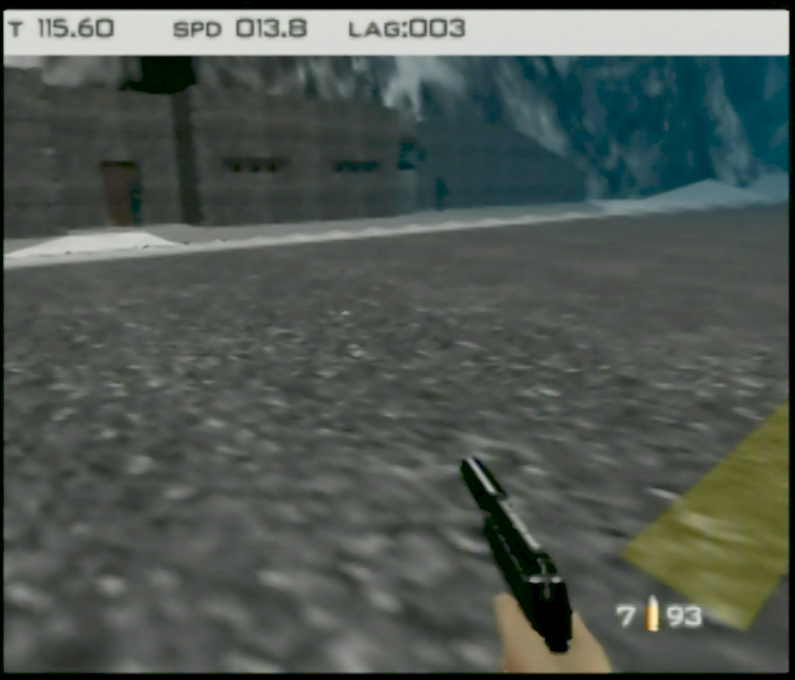
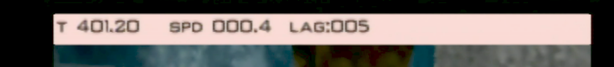

# Bond speed rom

This romhack is designed to show Bond's actual speed as displacement per update/frame.

# Version

The NTSC xdelta patch should be applied against US NTSC .z64 with SHA1 `ABE01E4AEB033B6C0836819F549C791B26CFDE83`.

# User Interface

The HUD looks like:

From left to right:

- `T`: mission timer
- `spd`: Amount Bond has moved since last update
- `lag`: Number of frames since last update.

When Bond collides with anything, the HUD changes to a slight red background

# Controller shortcuts

These shortcuts work in solo game mode, regardless of the current control style.

**Exit to title**:

controller 1: Z + DPAD Down + all C buttons + R trigger

or

controller 1: Z + DPAD Down  
controller 2: Z + DPAD Down  

**Restart stage**:

controller 1: Z + DPAD Down + Start

or

controller 1: Z + DPAD Down  
controller 2: Z + Start  
