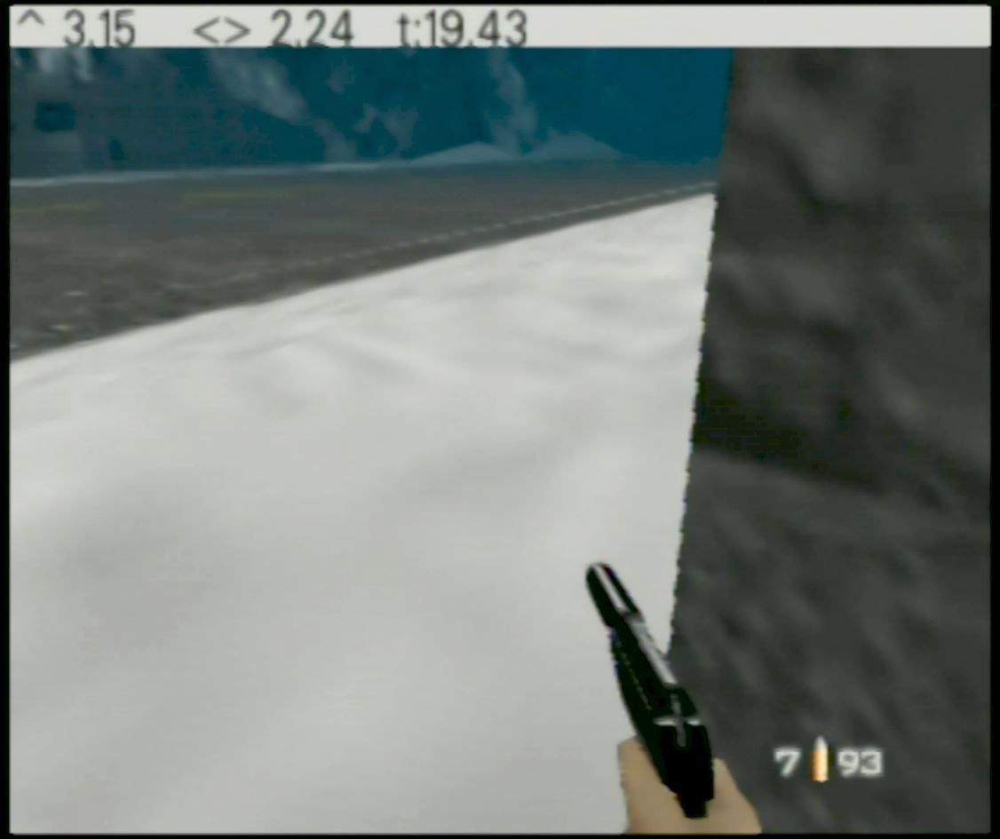

# Boost romhack

Press the DPad for a boost.

# Version

The NTSC xdelta patch should be applied against US NTSC .z64 with SHA1 `ABE01E4AEB033B6C0836819F549C791B26CFDE83`.

# User Interface

The HUD looks like:

From left to right:

- Current forward/back speed ("! 1.35").
- Max run speed indicator ("!")
- Strafe speed ("<> -1.00")
- Mission timer ("T:10.80")

# Details

When C_LEFT + C_UP, boost is applied 45 degrees to the left. When C_RIGHT + C_UP, boost is applied 45 degrees to the right. Otherwise the forward direction is used.

# Controller shortcuts

These shortcuts work in solo game mode, regardless of the current control style.

**Exit to title**:

controller 1: Z + DPAD Down + all C buttons + R trigger

or

controller 1: Z + DPAD Down  
controller 2: Z + DPAD Down  

**Restart stage**:

controller 1: Z + DPAD Down + Start

or

controller 1: Z + DPAD Down  
controller 2: Z + Start  
