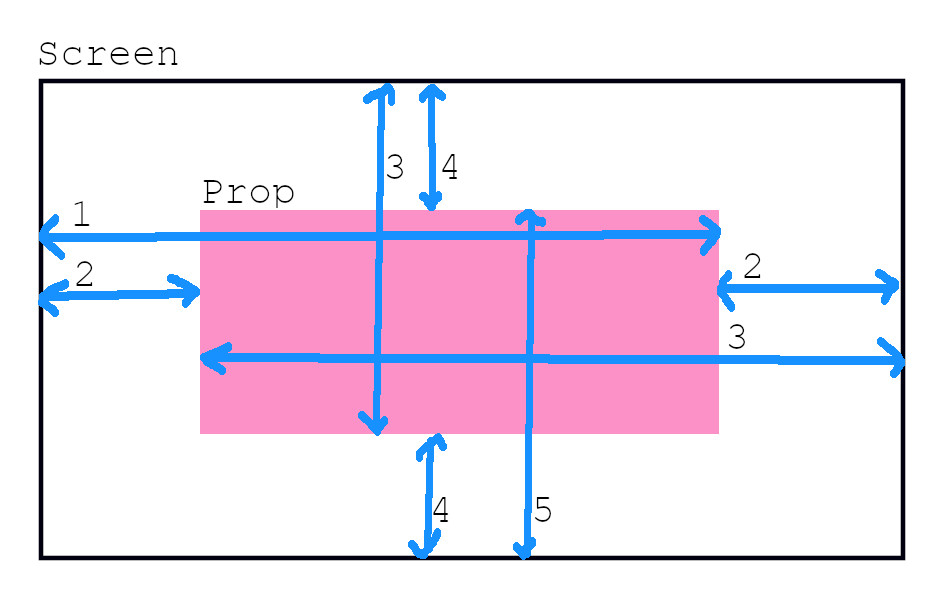
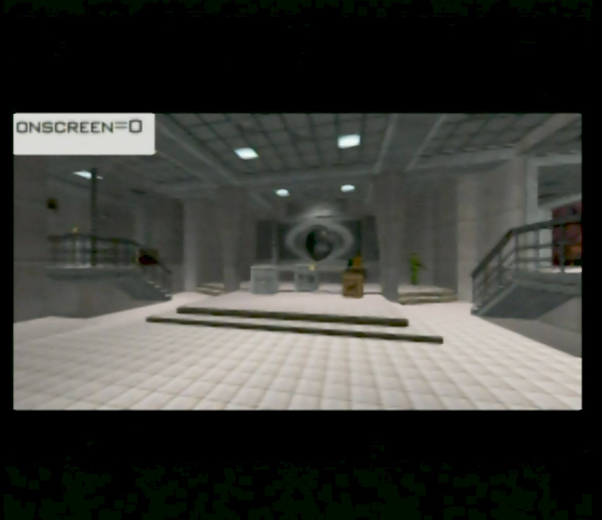
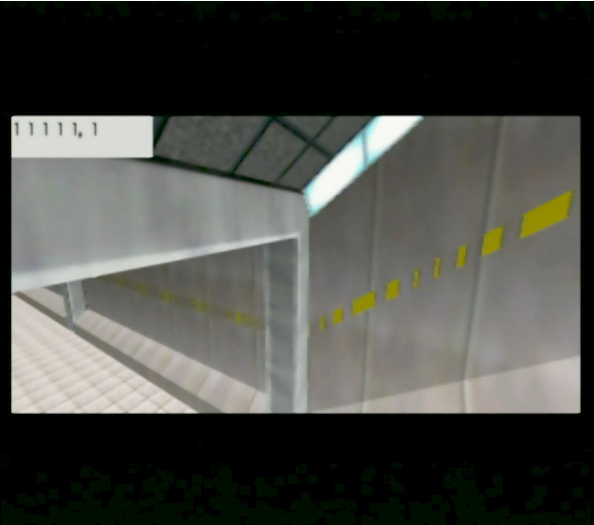
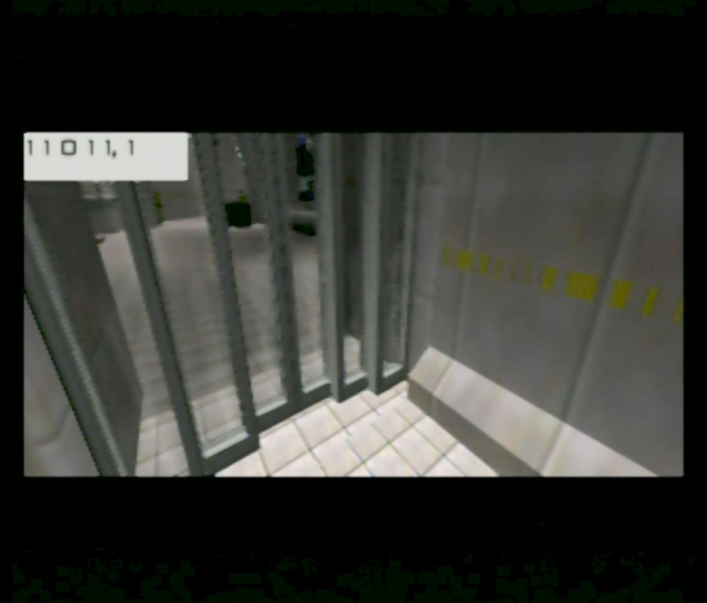
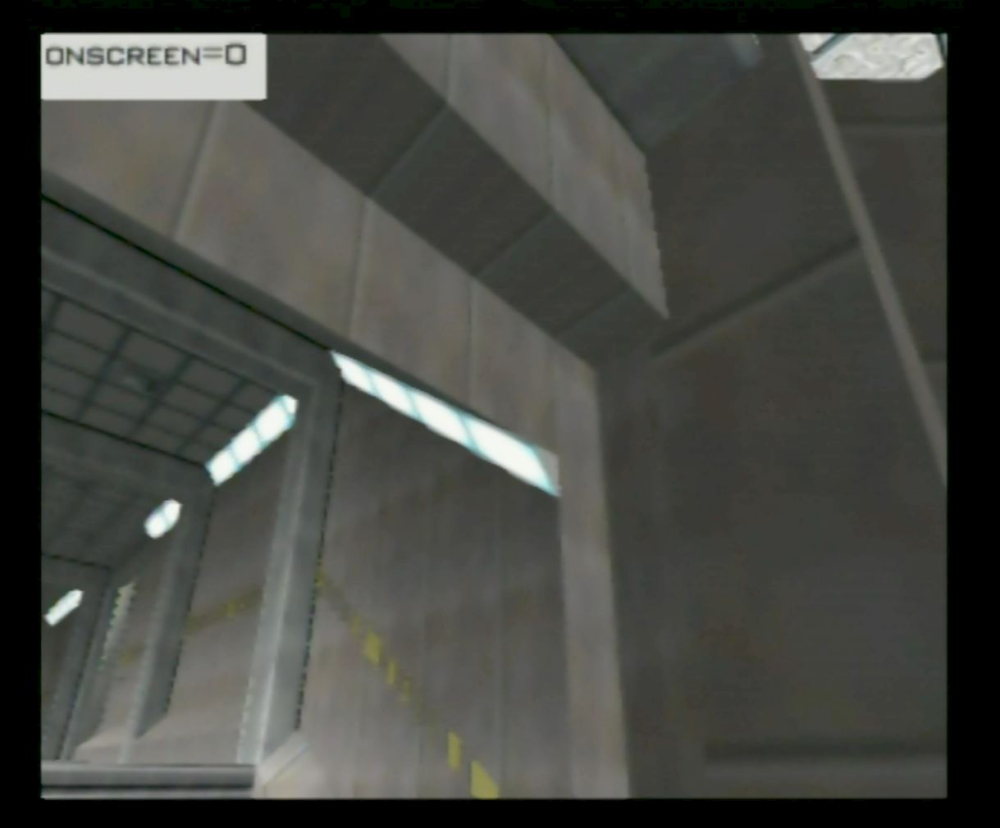
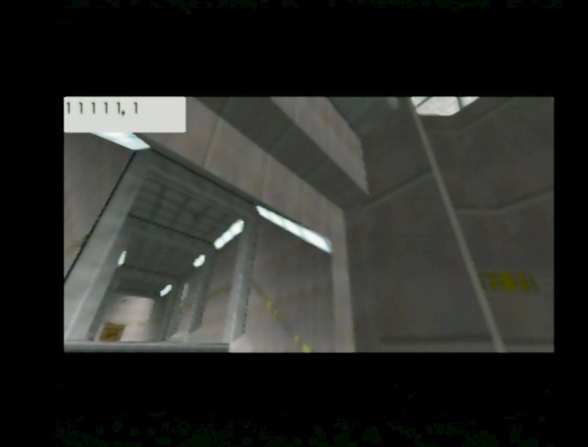

# Camera objective romhack

Shows which conditions fail when taking a picture for the camera objective.

source: https://tolos.me/goldeneye_romhack/camera_obj/index.html

# Version

The NTSC-U xdelta patch should be applied against US NTSC .z64 with SHA1 `ABE01E4AEB033B6C0836819F549C791B26CFDE83`.

# Info

The camera objective code is segmented into a number of conditions. All the conditions must pass in order for the objective to mark as complete.

I matched the camera objective function in decomp, but it's still hard to know exactly what the original code looked like. I've divided it into two phases.

Phase 1 consists of three and a half conditions to check for:

1. Is the prop on screen.
2. Is the render distance positive (is it in front of Bond).
3. Is the target destroyed.

The last "half" condition is a function call to get the prop location, but will fail if it's not on screen (which was just checked).

Being "on screen" is a bit of a vague concept. The most important consideration is whether the room is loaded or not. For example on Silo, the Satellite can't be onscreen before the door starts opening which loads the room. But if the room is loaded, the way the game culls objects is not very sophisticated so for the most part looking towards the object will be sufficient.

If the above conditions pass the code continues to Phase 2. This code checks that the prop is rendered within the screen. There are 8 conditions spread over 5 statements.

1. The left of player screen is to the left of the prop right edge.
2. The prop right edge is to the left of the (left+width) of the player screen, and the left of the player screen is to the left of the prop left edge.
3. The prop left edge is to the left of the (left+width) of the player screen, and the screen top is above the prop bottom edge.
4. The prop bottom edge is above the bottom of the screen, and the screen top is above the prop top edge.
5. The prop top edge is above the bottom of the player screen.

Here's a diagram to help explain the above.

This romhack shows the condition status for the camera objective. This only applies to Silo and Bunker 1. When you take a picture, the status of the conditions is printed in the top left. If the prop is not on screen that will be shown ("onscreen=0"), and no information about the other conditions will be known. If the prop is on screen the six digits will be printed. The first five digits correspond to the five position checks above. The last digit corresponds to the render distance being in front of Bond. A value of "1" means the condition passed while a value of "0" means the condition failed. When all the values are "1" that means the objective will complete.

# Screenshots

Showing when the prop is not on screen:

Example showing all conditions passing:

Example showing conditions failing:

Example showing conditions failing in fullscreen, but passing in cinema from the same position.

Example showing conditions failing in fullscreen, but passing in cinema from the same position.

