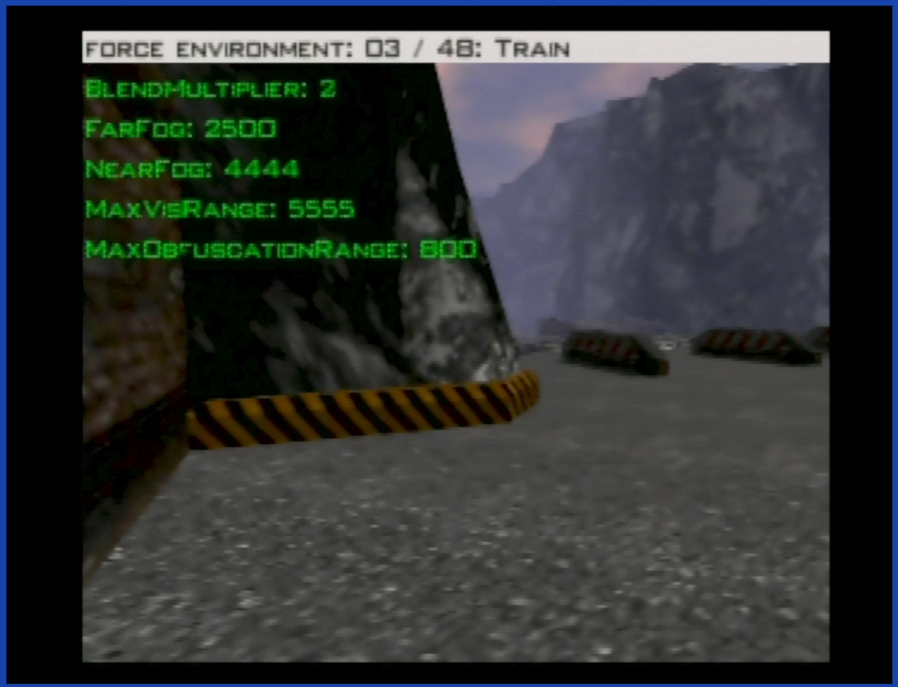
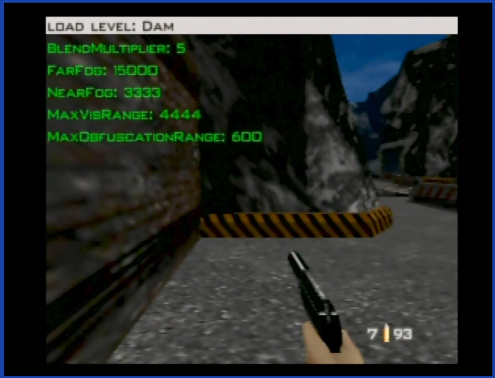

ROM hack to test environment / fog settings.

This is a fork of my previous lag romhack, see that for more details about the main HUD: https://github.com/burnsba/GoldeneyeRomhack/tree/main/lag

This is a NTSC only romhack.

xdelta patch should be applied on corresponding .z64 ROM with the following SHA1 hash:

    NTSC  : patch-NTSC.xdelta   `ABE01E4AEB033B6C0836819F549C791B26CFDE83`
    

    

### In level: ###

I added two "menus" to the main HUD. Press the shoulder L trigger to cycle through available HUD.

Press C UP and C DOWN to cycle through available options. Press A to load environment/level.

Second HUD screen:

This forces `Environment` settings to be loaded. This is not how the game normally works, but may be useful for testing. This is a list of all available settings, plus two more I added just for fun ("10/500" and "10/50").

Cycle though levels and load the level settings the way the game normally loads settings. Use this screen to test theories, .e.g, load Depot then load Silo, etc.

-----

When one of the environment HUD screens is active, the currently loaded values of 5 environment variables are shown on screen in green. As soon as new environment settings are loaded these values are updated.

- blend multiplier
- far fog (distance)
- near fog (distance)
- max visibility range
- max obfuscation range

### Controller shortcuts ###

These shortcuts work in solo game mode, regardless of the current control style.

**Exit to title:**

controller 1: Z + DPAD Down + all C buttons + R trigger

or

controller 1: Z + DPAD Down  
controller 2: Z + DPAD Down

**Restart stage:**

controller 1: Z + DPAD Down + Start

or

controller 1: Z + DPAD Down  
controller 2: Z + Start

**Cycle HUD menu**

L shoulder trigger

**Environment HUD shortcuts**

controller 1: C UP, C Down -- change selected option  
controller 1: A -- load selected option

### Notes: ###

Sorry for the bad user interface.

The game normally loads environment data by starting with the level, then checking the list of environments for that level. If found, will load those settings. Otherwise, it falls back to the first "fogless" environment settings but these don't have the fog or visibility values to load, so it uses the same values as last time.

Build version is shown on the opening screen.
