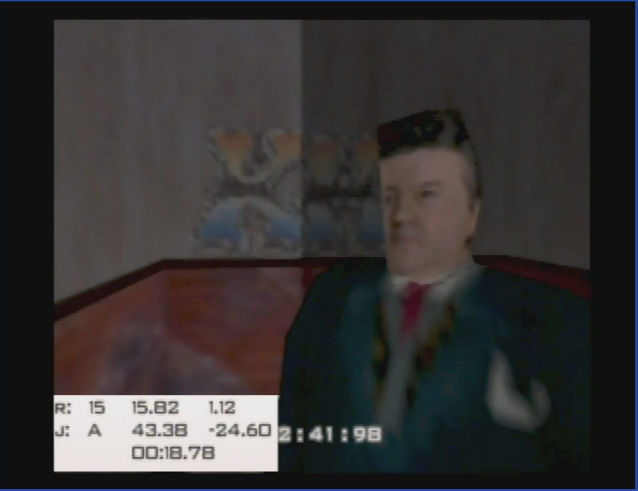
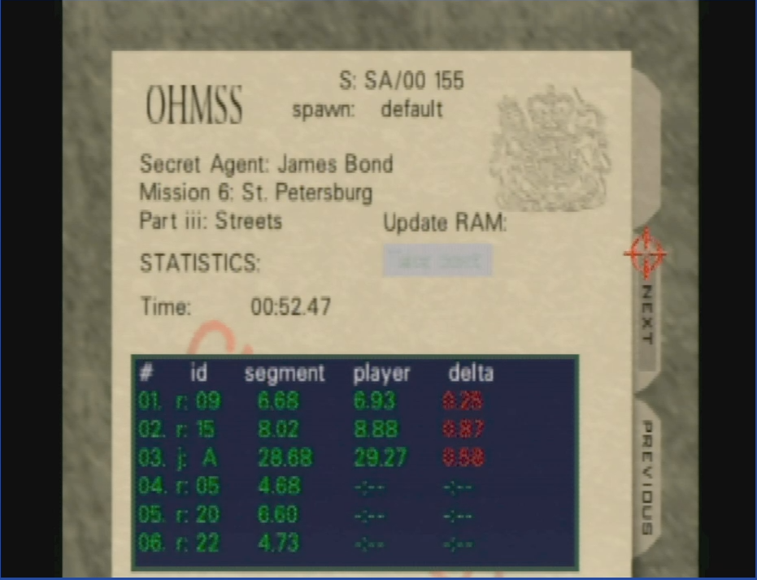
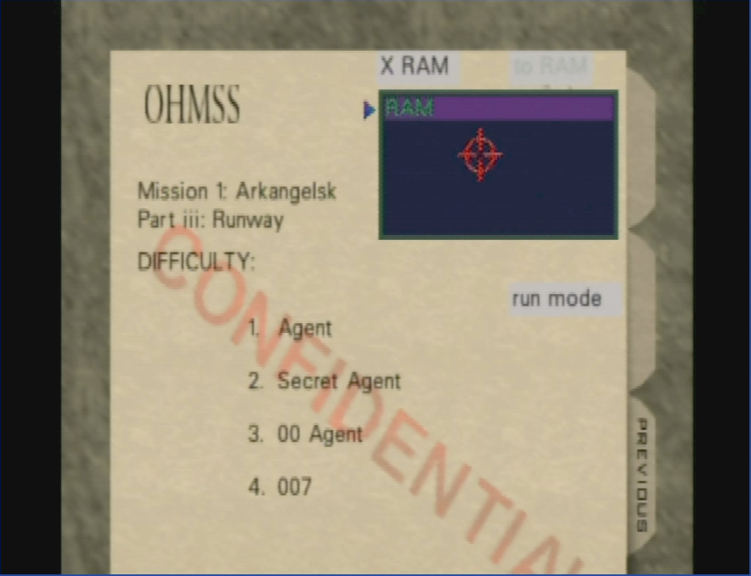
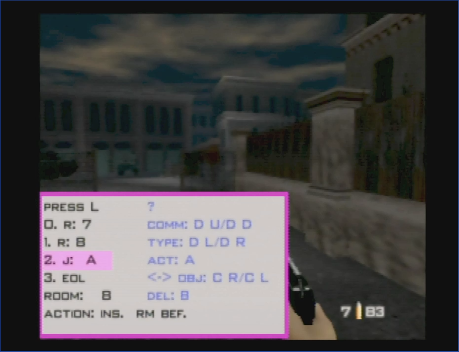
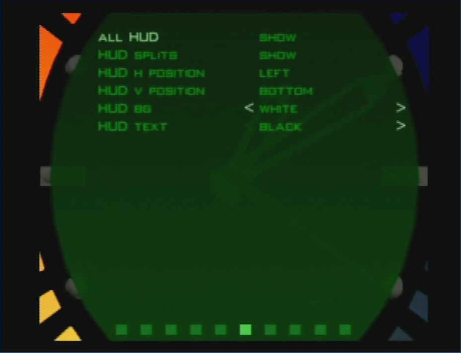
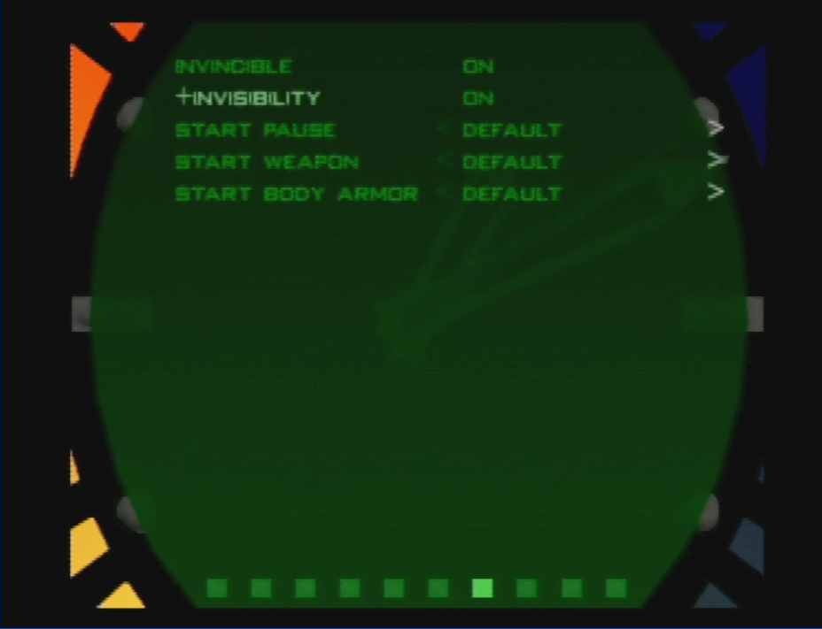
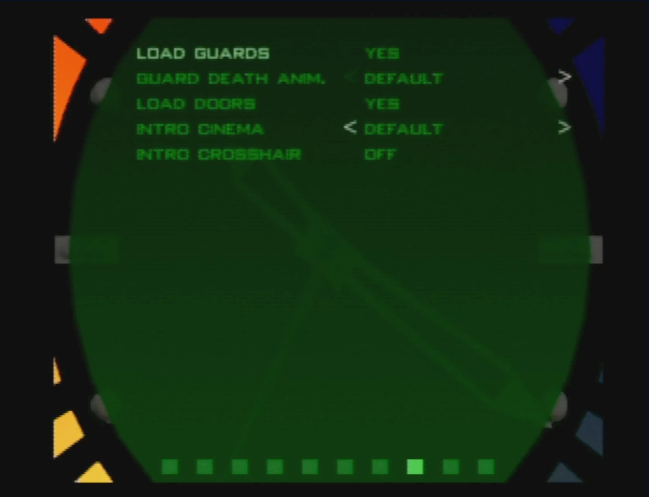
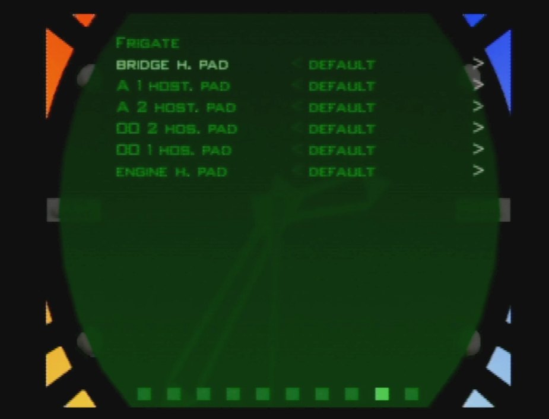
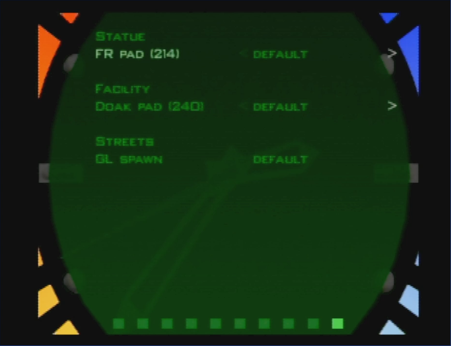

# Download

Current xdelta patch: [patch-NTSC-0.9b.xdelta](patch-NTSC-0.9b.xdelta)

Should be applied against NTSC .z64 with SHA1 `ABE01E4AEB033B6C0836819F549C791B26CFDE83`

Video detailed explanation and tutorial: [https://www.youtube.com/watch?v=k5r-XYgHBnU](https://www.youtube.com/watch?v=k5r-XYgHBnU).

# Purpose

The goal is to provide a test environment on console that you can configure from within the game itself. Contrast this with any other (so far) available romhack that requires using the PerfectGold setup editor to tune parameters, change starting position, etc.

The guiding principle for this project is flexibility. Instead of practicing a particular strategy a particular way, you should be able to setup your own practice session using your own parameters.

# Scope & Limitations

Flexibility comes at a cost. I have intentionally limited what kinds of split targets are available (or rather, intentionally chosen not to implement alternatives). One of the practical reasons for doing so is that anything more advanced is going to make the UI even harder to use, and IMO probably better to work with PerfectGold at that point. So think of this project as something vast in breadth, widely applicable to many situations, but not surgically precise. If you need a very focused practice ROM, like knowing when a guard is loaded, then refer to WhiteTed's Splits rom.

Also note that none of the watch menu settings are saved / none are used as part of splits definitions. The only thing that can be specified as part of splits are spawn point, split row target type, and split row target time.

If you encounter any bugs, let me know. If one of the assumptions I make below is wrong, let me know. Anything related to location / spawn point should be considered experimental.

This romhack has been tested on Everdrive64 x7.

# Features Overview

Here is a bullet point summary of features, explained in more detail following.

- Splits
  - Adds pre-defined splits to the ROM. Two are available in this release: Streets 155, Dam 54
  - Adds one "RAM" split for editing/updating during session
  - Choose splits at difficulty select screen
  - Single "RAM" split available, only stored in memory for play session (it's actually shared across all 4 folders, but it's not saved to EEPROM)
  - ROM splits: just compare against times
  - RAM split: you can "take best" segments and update the target times for the session
  - "X RAM" UI button to clear out existing RAM splits
  - "To RAM" UI button to copy an existing ROM split to RAM
  - "Run Mode" / "Edit Mode" toggle button, allows editing RAM splits

- Splits - "Run" mode
  - Auto split based on two target types
    - room: when Bond enters a room for the first time
    - objective: when an objective completes
  - HUD shows: previous split row, upcoming split row, mission timer
  - Split row shows target (room/objective), target absolute time, player delta to time

- Splits - "Edit" mode
  - Allows editing the single RAM split
  - Add/remove room "target" to splits
  - Add/remove objective "target" to splits
  - Set/clear spawn point for split
  - (no other settings are saved/loaded as part of splits, so there is nothing else to edit)

- End screen
  - Shows name of currently active splits
  - Shows split spawn point
  - "EOL" - end of level split row to compare mission timer
  -  When using RAM Splits: UI Button to "take best" to update target segment times
  - Lists split rows: target type, target time, player time
  - Toggle between "absolute" time and "segment" time
  - After leaving the endscreen, pressing "B" on the next screen takes you back to the end screen.

- Watch menu 6 - Romhack UI
  - All HUD: show / hide HUD
  - HUD Splits: show/hide top two splits rows in HUD (run mode)
  - HUD H position: HUD position in run mode
  - HUD V position: HUD position in run mode
  - HUD BG: HUD background color
  - HUD Text: HUD text color

- Watch menu 7 - Bond
  - Invincible
  - +Invisibility
  - Start pause: Number of previous pauses to start level at
  - Start weapon: inventory item to actively hold at start of level
  - Start body armor: amount of body armor to start level with

- Watch menu 8 - Not Bond
  - Load guards
  - Guard death anim: Force all guards to use this death animation
  - Load doors
  - Intro cinema: force intro cinema, or disable entirely
  - Intro crosshair: show crosshair in opening cinema

- Watch menu 9 - Frigate
  - Bridge h. pad: target pad for bridge hostage
  - A 1 host. pad: target pad for hostage first seen when opening door
  - A 2 host. pad: target pad for hostage in adjacent room
  - 00 2 hos. pad: target pad for lower deck hostage with single captor
  - 00 1 hos. pad: target pad for lower deck hostage with two captors
  - Engine h. pad: target pad for engine room hostage

- Watch menu 10 - Group1
  - FR pad (214): target pad for statue Flight Record (214 is ideal)
  - Doak pad (240): Facility Dr. Doak spawn pad (240 is ideal)
  - GL Spawn: whether to force streets guard spawns to always have Grenade Launcher

# Performance Considerations

I have made quite large changes to the game, in the sense that I deleted multiplayer and spectrum emulation, which is some 10's of k of code. But almost all my changes are limited to the user interface, in the folder menus and the watch menu. Where I did make changes, the code changed is targeted and precise. For example, intercepting the Flight Recorder spawn is contained within a single AI switch statement, and that code is rarely run.

I split "Run mode" and "edit mode" to further partition performance impacts. Drawing the HUD should be the most expensive part of the main update, the cost to performance should still be sub 1ms with room to spare. You can disable the entire HUD if you want, but if you are that concerned about performance then maybe just stick with the retail version.

# Feature Details

"Run" mode screen:

The above image shows the previous split was room target 15, achieved at absolute time 15.82, player was 1.12 too slow. Row 2 shows the next target is objective A, at absolute time 43.38, and player is currently 24.60 seconds ahead. Last row is mission timer.

//

endscreen:

Show split name at top. Shows default level spawn was used. Illegible "Take Best" button is disabled because this is ROM splits. This shows the first six splits for the level. Player died or quit after objective A and before splits row 4.

//

Difficulty select:

Available splits are listed in the blue box. Only default "RAM" split is available for this stage. Button to clear ram splits "X RAM" is enabled. Button to copy ROM splits to RAM "To RAM" is disabled. Currently in "Run Mode" with option to toggle over to "Edit Mode" because RAM splits are selected.

//

"Edit" mode, after opening menu

Lists 4 split rows on the left. In order: room target 7, room target 8, objective A, end of level (automatic). Below that it shows the current room Bond is in. On the right is help text to explain how to use edit mode. If the "A" button were pressed, it would execute the action "inc. rm bef." This means it would add a split row before the highlighted row, using Bond's current room as the target; in this case it would insert a duplicate room 8 target.

//

Watch menu 6 - Romhack UI

This is hopefully self explanatory, the only thing I will note is that the "BG" option can scroll left to "none" (transparent).

//

Watch menu 7 - Bond

The +Invisibility also disables security cameras and drone guns, but allows important NPC's (val, etc) to see Bond. Start weapon sets the inventory item Bond is actively holding at the start of the level. Available options:

throwing knife
kf7 soviet
zmg (9mm)
d5k
d5k (silenced)
phantom
ar33
sniper rifle
golden gun
laser
watch laser
grenade launcher
rocket launcher
grenade
timed mine
remote mine
taser
watch magnet
plastique
key analyzer
goldeney key
guidance data
door decoder
detonator
datathief
camera
bug

Choosing either "key analyzer" or "goldeney key" adds the other to your inventory.

//

Watch Menu 8 - Not Bond

Intro cinema can scroll left to "disable" or right to specify 1-6. If there are fewer intros available than selected, it will take the highest value.

//

Watch Menu 9 - Frigate

Available target pads: 0x8f, 0x91, 0x93, 0x94, 0xa8, 0xa9. This is experimental. I think this only sets the target once. If you notice something odd, let me know.

//

Watch menu 10 - Group1

Flight Recorder pads: 0xcd, 0xd6, 0xd0, 0xc8, 0xcb, 0xc4, 0xd5, 0xc2, 0xc0
Doak spawn pad: 0xee, 0xef, 0xf0, 0xf1, 0xf2, 0xf3, 0xf4

# Controller shortcuts

These shortcuts work in solo game mode, regardless of the current control style.

**Exit to title**:

controller 1: Z + DPAD Down + all C buttons + R trigger

or

controller 1: Z + DPAD Down
controller 2: Z + DPAD Down

**Restart stage**:

controller 1: Z + DPAD Down + Start

or

controller 1: Z + DPAD Down
controller 2: Z + Start

-----

# Tutorial

**How to set spawn**:

- Go to difficulty select screen
- Clear out RAM splits if they aren't already
- Switch to "Edit Mode"
- Start the level
- Walk to where you want to spawn
- Press L trigger to bring up edit mode menu
- Cycle through commands with D pad up/down until you get to anything that says "spawn" then - scroll D pad left/right until it says something like "set spawn 0x1f00a0".
- Press the "A" button to save your spawn pad
- Test your change: exit edit menu with L, walk a few steps, open edit menu and choose "goto - spawn 0x1f00a0". If it says "goto spawn def." then it didn't save for some reason (there are - some checks to prevent crashes). Let me know if that happens. Press "A". It should teleport you  back to your new spawn. If your game didn't crash, it worked!
- Quit out of the stage.
- On difficulty select, change from "Edit Mode" to "Run Mode"
- Load the level. You should be at your new spawn point

There will probably be some camera glitches as your zoom into Bond. Let me know if you get any game crashes.
