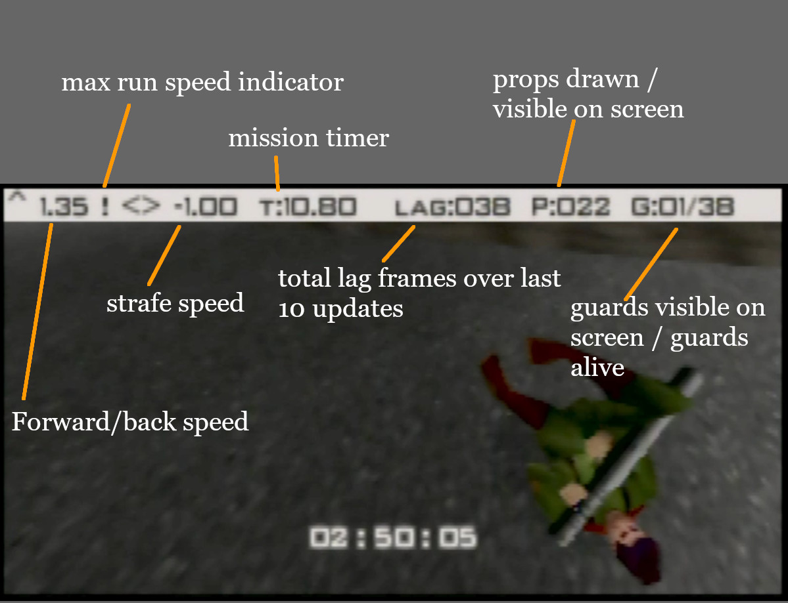
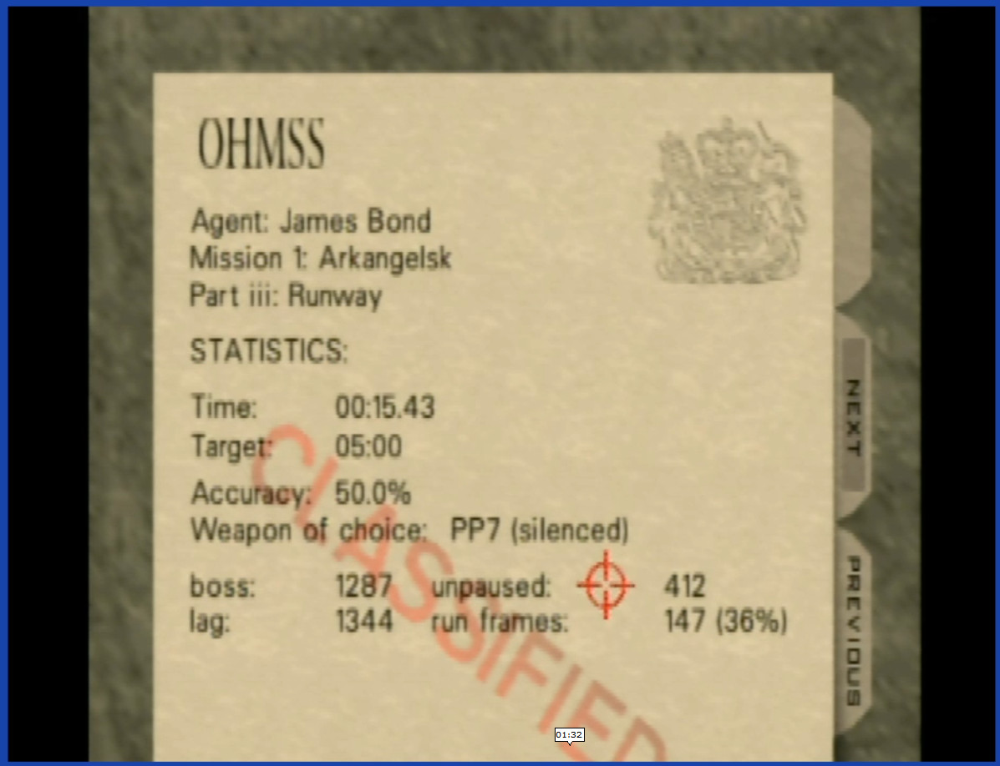

Quick ROM hack to show timing information. This adds a HUD to the top of the screen in level.

### In level: ###

From left to right:

- Current forward/back speed ("! 1.35").
- Max run speed indicator ("!")
- Strafe speed ("<> -1.00")
- Mission timer ("T:10.80")
- Lag counter ("LAG:038")
- Props drawn this update ("P:022")
- Guards visible on screen / guards alive ("G:01/38")

### End screen: ###

- Adds decimal to time shown on screen.
- total main loop iterations ("boss: 1287")
- total skipped frames ("lag: 1344")
- Count of frames Bond is active ("unpaused: 412")
- max runspeed frames ("run frames: 147 (36%)")

### Controller shortcuts ###

These shortcuts work in solo game mode, regardless of the current control style.

**Exit to title:**

controller 1: Z + DPAD Down + all C buttons + R trigger

or

controller 1: Z + DPAD Down  
controller 2: Z + DPAD Down

**Restart stage:**

controller 1: Z + DPAD Down + A + B + Start

or

controller 1: Z + DPAD Down  
controller 2: Z + Start

### Notes: ###

I've had the watch quit out timer and end screen timer differ (by 0.01), these use the same value so I'm not sure what is happening.

Lag counter is sum of skipped frames over the previous 10 boss loop updates, the HUD value can be divided by 10 to indicate the average number of frames dropped.

The "unpaused" frame count begins after the opening cinema and ends before the ending cutscene. This does not include frames when the game is paused.

Run frames is the number of frames Bond is at max run speed (ignoring any forward/back boosts). The percent is out of the total "unpaused" frames.

Build version is shown on the opening screen.
