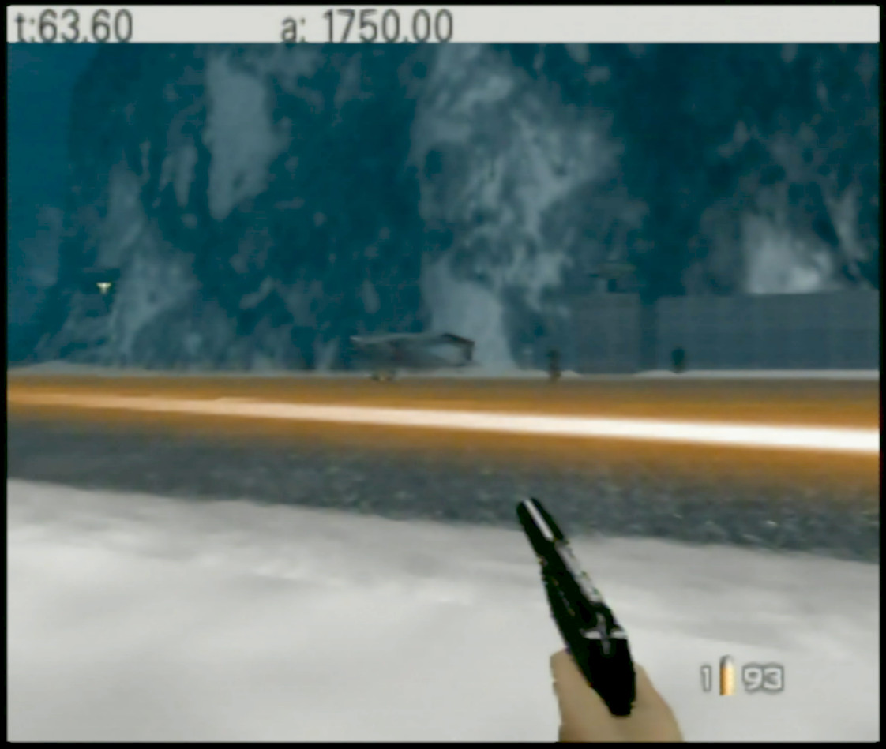

Quick ROM hack to show mission timer and current airplane prop hit points. The best cinema is always chosen.

File hash information. The baserom SHA1 is given, and the corresponding hash of the xdelta patch to apply.

    NTSC  : baserom   `ABE01E4AEB033B6C0836819F549C791B26CFDE83`
          :  xdelta   `F457BB303C71CE226E4C56C5E182E7F799FC70FF`
    

### In level: ###

### Controller shortcuts ###

These shortcuts work in solo game mode, regardless of the current control style.

**Exit to title:**

controller 1: Z + DPAD Down + all C buttons + R trigger

or

controller 1: Z + DPAD Down  
controller 2: Z + DPAD Down

**Restart stage:**

controller 1: Z + DPAD Down + Start

or

controller 1: Z + DPAD Down  
controller 2: Z + Start

### Notes: ###

All cheats and stages are unlocked. Cinema #1 (the 2.4 lure one on Runway) is always chosen regardless of stage.

Props start at zero `damage` and work towards `maxdamage`. The airplane will explode at 20,000 damage.