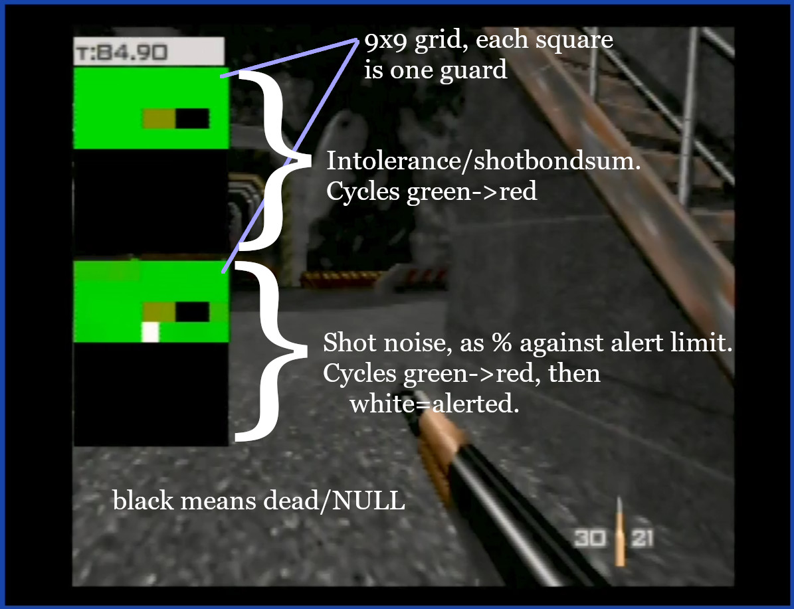

Quick ROM hack to visualize shot information. Shows guard intolerance and noise threshold.

All three versions of the game have an xdelta patch, which should be applied on corresponding .z64 ROM with the following SHA1 hash:

    NTSC  : patch-NTSC.xdelta   `ABE01E4AEB033B6C0836819F549C791B26CFDE83`
    NTSC-J: patch-NTSC-J.xdelta `2A5DADE32F7FAD6C73C659D2026994632C1B3174`
    EU    : patch-EU.xdelta     `167C3C433DEC1F1EB921736F7D53FAC8CB45EE31`

(I have only tested NTSC)


### In level: ###



Added display on left side of screen. From top down:

- Mission timer.
- Intolerance block, 9x9 grid, each square is one guard.
- Noise block, 9x9 grid, each square is one guard.

### End screen: ###

(not shown).

- Adds decimal to time shown on screen.

### Controller shortcuts ###

These shortcuts work in solo game mode, regardless of the current control style.

**Exit to title:**

controller 1: Z + DPAD Down + all C buttons + R trigger

or

controller 1: Z + DPAD Down  
controller 2: Z + DPAD Down

**Restart stage:**

controller 1: Z + DPAD Down + Start

or

controller 1: Z + DPAD Down  
controller 2: Z + Start

### Implementation: ###

I tried to minimize in game impact on timing (I had to cut out some other data I wanted to show). Additional overhead to RDP render cycle is minimal (10s of microseconds). CPU overhead is more substantial, but should be less than 300 microseconds (0.0003 seconds) per boss main loop (according to some back-of-envelope estimates).

`shotbondsum` is a property on a guard. This is updated every time the chr shoots at bond. In the main boss loop I just read this off the guards that exist. Here is a very rough outline of how this is computed:
```
// adjust for lag frames
local_shotbondsum = 0.16f * g_GlobalTimerDelta;

// if bond is too far away, scale down ability to hit
if (distance_to_bond > 300.0f)
{
    local_shotbondsum *= (300.0f / distance_to_bond);
}

if ((s32) guard->accuracyrating > 0)
{
    local_shotbondsum *= (1.0f + ((f32) guard->accuracyrating / 10.0f));
}

// adjust for 007 mode custom slider accuracy if necessary
local_shotbondsum *= get_007_accuracy_mod();

local_shotbondsum *= g_AiAccuracyModifier;

if (bondwalkItemGetAutomaticFiringRate(item) <= 0)
{
    local_shotbondsum *= 2.0f;
}

if (/* guard weapon is shotgun or auto shotgun*/)
{
    local_shotbondsum *= 2.0f;
}

guard->shotbondsum += local_shotbondsum;

if (guard->shotbondsum >= 1.0f)
{
    // damage bond
    ...
}
```

Noise level is a little bit different. It's not stored as a property on the guard. Instead, when a shot is fired the game iterates every guard and checks to see if they can hear the noise. I save the value when this check is performed.

Each guard has a property `hearingscale` to adjust how well they can hear. The noise check code is very roughly:
```
void check_if_guard_hears_noise(s32 noise)
{
    foreach (var guard)
    {
        f32 limit = distance_to_bond3d(guard);
        f32 compare = guard.hearingscale * (noise * 100.0f);

        if (compare > limit)
        {
            alert_guard(guard);
        }
    }
}
```

In the above loop I save the `compare` value as a percent against `limit`. This is shown on the HUD, scaled from green (0%) to red (99.9%). Once the guard is alert, I set the HUD value to white.

Because the noise values are only checked (updated) when a noise occurs, I clear the noise HUD after a few seconds.

### Notes: ###

Build version is shown on the opening screen.
