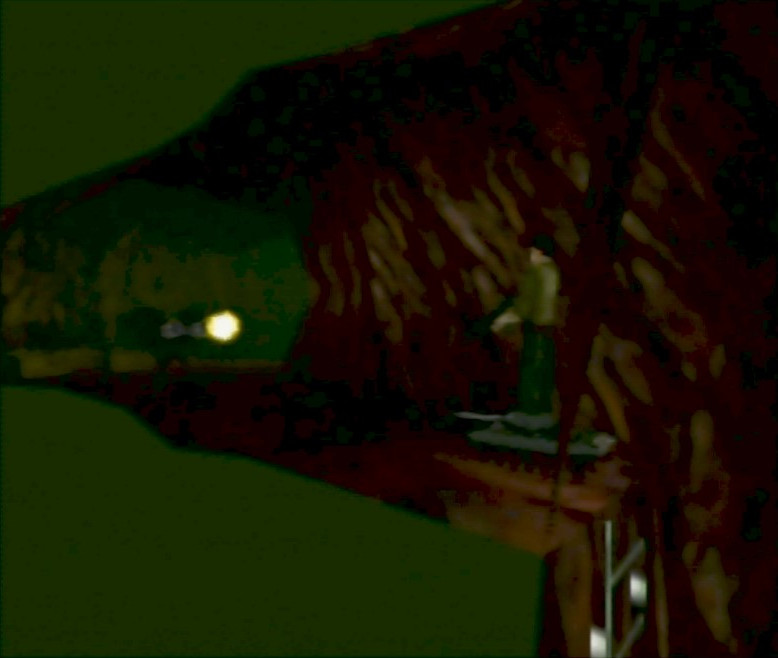

# TANKBOND romhack

This is a quick romhack to play the game in a tank.

Youtube demo: https://www.youtube.com/watch?v=qbeC5Tavnq0

source: https://tolos.me/goldeneye_romhack/tankbond/index.html

# Version

The NTSC-U xdelta patch should be applied against US NTSC .z64 with SHA1 `ABE01E4AEB033B6C0836819F549C791B26CFDE83`.

# Info

For technical reasons, you enter the tank and start the engine as soon as the stage starts. You are given tank ammo on every stage except Archives and Bunker 2.

The tank is scaled down quite a bit. Clipping code has been modified, the tank bounding box is smaller than the model. The stan navigation code has also been modified to use a hybrid between the tank code and bond code. You can drive up ramps/stairs and warp up and down ladders. There are a few places in the game that are not handled very well, but every stage is completable. Known challenge areas: Aztec under the shuttle, Depot exiting the safe room into the warehouse, and you can no longer warp back to the top of the pit at the start of Aztec.

Minimum lower angle in the tank has been lowered to -40 degrees from -20. Max tank speed hasn't been changed, but you can rotate slightly faster now.

There is not enough texture memory on some levels, so there will be noticeable artifacts. This affects the on screen crosshair and weapon ammo icon on screen. You can see other errors, such as bullet tracers and the cloud texture on Dam. I tried a few different things to fix this without success. I wanted to keep this romhack short in development time, so just going to release with this issue. Levels affected: Dam, Surface 1/2, Archives, Depot, Jungle.

# Screenshots

