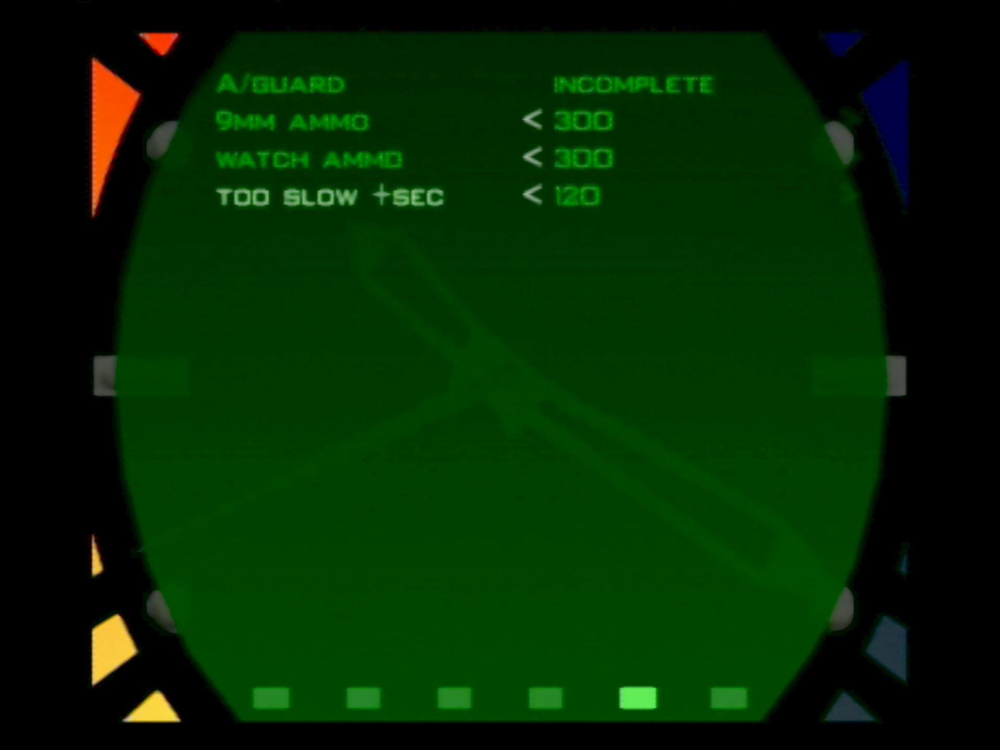

# train end romhack

Romhack to practice train ending, specifically for DLTK.

source: https://tolos.me/goldeneye_romhack/train_end/index.html

# Version

The NTSC-U xdelta patch should be applied against US NTSC .z64 with SHA1 `ABE01E4AEB033B6C0836819F549C791B26CFDE83`.

# Info

- Spawn is moved to the last door.
- Remove intro cinemas.
- Unlock final door.
- Add D5K and ZMGx2 to inventory.
- Objective A toggle.
- Choose starting ammo.
- Option to add additional time to pre-countdown encounter.

I added settings in a new watch menu screen (second to last).

The first option controls Objective A (brakes). When complete, the last two guards are not spawned. When incomplete you will need to clear the brakes like normal.

There are two options to control the amount of starting ammo, one for 9MM and one for watch laser.

The last option adds extra time to Trev's script (0x413). Normally you have 30 seconds before he says "Too slow," but you can add additional seconds here. (Note: it's listed in increments of 10, but with lag this is more like 12).

# Screenshots

# Controller shortcuts

These shortcuts work in solo game mode, regardless of the current control style.

**Exit to title**:

controller 1: Z + DPAD Down + all C buttons + R trigger

or

controller 1: Z + DPAD Down
controller 2: Z + DPAD Down

**Restart stage**:

controller 1: Z + DPAD Down + Start

or

controller 1: Z + DPAD Down
controller 2: Z + Start