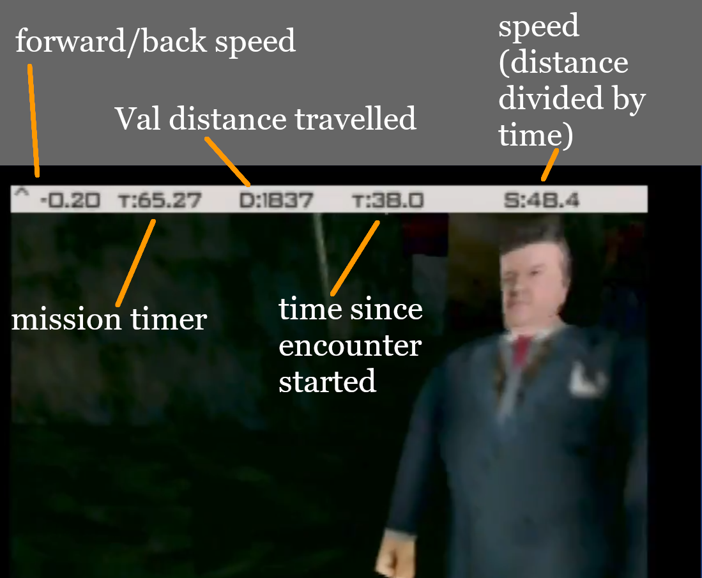
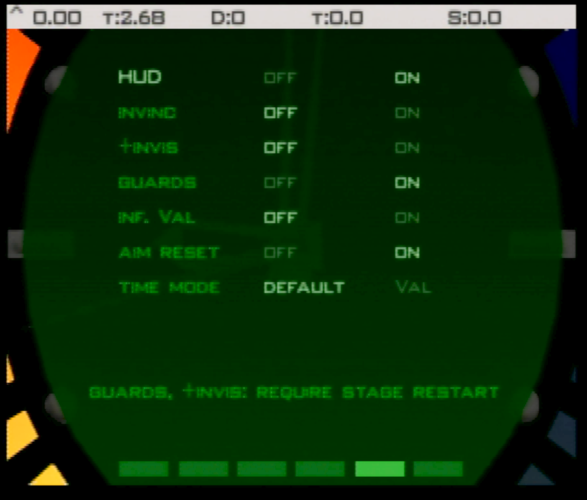

# Val strafe practice ROM

This romhack is designed for practicing strafing Valentine on Statue and Streets. A HUD is added to show distance Val has traveled, time since the encounter started, and speed (distance divided by time).

youtube overview: https://youtu.be/fxueQpCEoYw

# Version

The NTSC-U xdelta patch should be applied against US NTSC .z64 with SHA1 `ABE01E4AEB033B6C0836819F549C791B26CFDE83`.

2022-03-23 (v1.1): Add "timer mode", with "default" and "Val" option. 
2022-03-12 (v1.0): initial release  

# User Interface

The HUD looks like:

From left to right:

- `^`: shows current forward/back speed
- `T`: mission timer
- `D`: Distance Val has traveled. This is every step he takes, it will include every back and forth bit (this is not straight line from his starting point).
- `T`: Val Timer. Timer starts counting the first time his line-of-sight check succeeds. If you reset the stats after the encounter starts, this is time since reset. (units are ticks divided by 60)
- `S`: Speed Val is travelling. This is total distance divided by total time (scaled by 60).

The watch menu looks like:

From top to bottom:

- HUD: The main HUD at the top of the screen. Value should be saved and loaded with the current folder.
- "invinc": standard invincibility cheat. This should sync with the cheat menu option. (does not save/load)
- "+invis": (partially) improved invisibility cheat. This should sync with the cheat menu option. More details below. (does not save/load)
- guards: toggles guard spawns on or off. Value should be saved and loaded with the current folder.
- "inf. Val": Infinite Val timer. Val event (Streets, Statue) will not end when this option is enabled. Value should be saved and loaded with the current folder.
- aim reset: Press the "aim" key to reset the event stats. This is the R trigger for 1.x controls, and Z trigger (left controller) for 2.x. Value should be saved and loaded with the current folder.
- timer mode: "Val" mode will stop the onscreen mission timer the frame that Val line of sight check succeeds.

# +Invisibility
Standard invisibility cheat with some additional changes. ~Sets drone gun aim distance to 1cm.~ (not included) ~Periodically resets security camera "seen Bond" internal count so that alarm threshold is never reached~ (not included). Allows line of sight check to succeed for the following:

- Facility: Trev, Dr. Doak
- Bunker 1: Boris
- Bunker 2: Natalya
- Statue: Trevelyn, Valentine
- Archives: Natalya, Mishkin
- Streets: Valentine
- Train: Xenia, Ouromov, Natalya
- Control: Natalya

# Guard Option
Disables guards during initial stage setup. Also intercepts other guard creation events, like cloning and AI scripts. Exception was made for Dr. Doak to still spawn even with guards disabled. The NPCs listed in the "+Invisibility" section are excluded as well (they will always be loaded).

# Controller shortcuts

These shortcuts work in solo game mode, regardless of the current control style.

**Exit to title**:

controller 1: Z + DPAD Down + all C buttons + R trigger

or

controller 1: Z + DPAD Down  
controller 2: Z + DPAD Down  

**Restart stage**:

controller 1: Z + DPAD Down + Start

or

controller 1: Z + DPAD Down  
controller 2: Z + Start  
